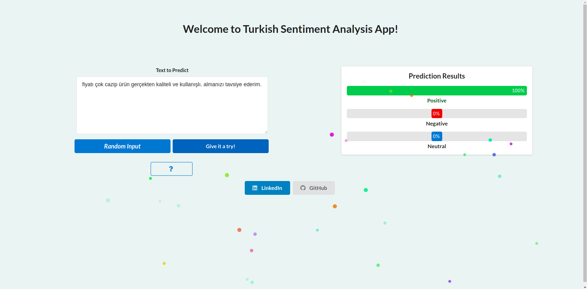

# Turkish Sentiment Analyzer App



Tuskish Sentiment Analyzer application to determine the sentiment of the input text. The used model in the application is a fine-tuned version of the ELECTRA model, BERT model can be used as well.

# How to run the app?

- Clone the repository.
- Make sure you have docker and docker-compose in your environment.
- Navigate to the app folder.
- Run the following docker command.

```ruby
docker-compose up --build
```
- Wait until you see the initialization of the app.

```ruby
web_1 | INFO: Application startup complete.
```

- Navigate the following url in any web browser.

```ruby
http://0.0.0.0:8080/
```
